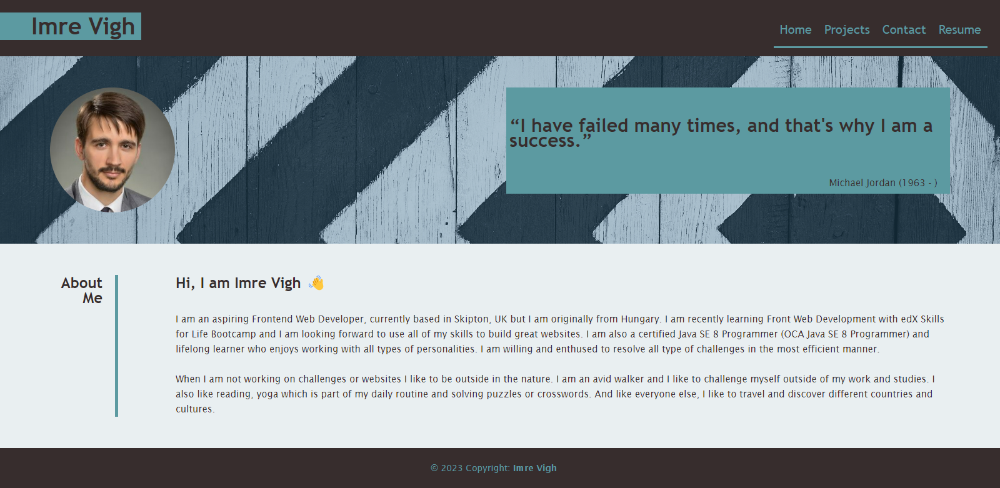
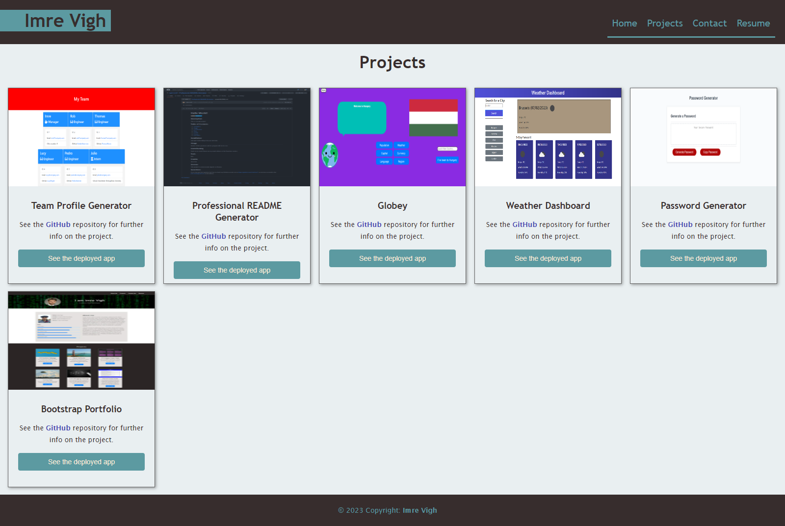
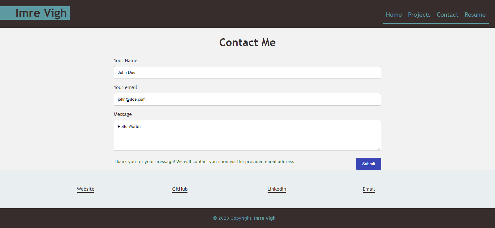

# React Portfolio Website

 [](https://opensource.org/licenses/MIT)

## Description
It is my previous CSS portfolio website recreated with React JS and CSS. You can find infomration about the author, recent projects and contact information.

## Table of Contents
  - [Installation](#installation)
  - [Usage](#usage)
  - [Contributing](#contributing)
  - [Tests](#tests)
  - [License](#license)
  - [Questions](#questions)

## Installation
  1. Download the master folder from GitHub.
  2. In order to run the application you will need Node JS (I used v16.1). If you haven't got it, install it on your computer.
  3. Once you have these steps navigate to the root folder in the command line and create a new React application:
  ```
  npx create-react-app [app-name]
  ```
  4. Then run the next command to install React Router DOM:
  ```
  npm i react-router-dom
  ```
  5. From the downloaded project copy the src folder and replace src folder in the newly created React app.
  6. Run the next command to fetch the website:
   ```
  npm start
  ``` 

## Usage
As a user when you open the website in your browser you will find a header with a navbar containing the corresponding links to different components of the website, a jumbotron with a photo and a quote, an about section that briefly introduce the author and a footer. The header and a footer are rendered accross the entire website while the other components are changing. If you click on the Projects link in the navbar it will take you to the Projects page that will be dinamically rendered as the Contact page too. The Projects page consists of six projects of the author with the title of the project, a link to the GitHub repository and a link to the deployed application. All the project information are coming from the Project component that gets the data from a JSON file. The Contact page contains contact information of the author and it has a contact form as well which uses React Hooks for handling events. The navbar also contains a link to the Resume that lets you download the author's resume with up-to-date projects and professional experience.

Please see a mockup image of the Home page:

  <br>
  
  <br>

On the next image you can see a demonstration of the Projects page:

<br>
  
<br>

Finally you can see an image of the Contact page:

<br>
  
<br>


## Contributing
  Any contribution is greatly appreciated.
  If you have any suggestion that would make this project better, please fork the repo and create a pull request. You can also just open an issue with the "enhancement". And also don't forget to give a star to the project!
  1. Fork the Project
  2. Create your Feature Branch (git checkout -b [featurebranch])
  3. Commit your Changes (git commit -m '[add your message here]')
  4. Push to the Branch (git push origin [featurebranch])
  5. Open a Pull Request

  ## Tests
  There are no tests for this project but feel free to add your own tests.

  ## License
  This project is covered under MIT license.

  ## Questions
  If you have got any question feel free to check out my GitHub account on https://github.com/vighimre87 or send me an email to the [vighimre87@gmail.com](mailto:vighimre87@gmail.com) email address.